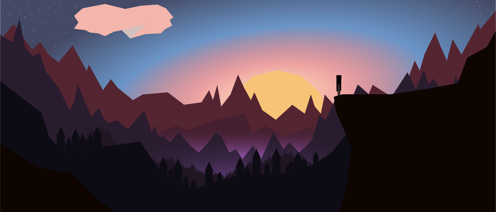

# Endie
Picture of an enderman looking longingly at an enderman rave under the sunset!

Apparently GitHub Hates gradiants (likely because it's stripping the CSS) so follow [this link](https://raw.githubusercontent.com/MagikEh/Endie/main/EndieMousePad.svg) for the full experience!

Originally made for a 70x30 cm desk pad @300 dpi (8268w x 3543h pixels)
But it's SVG so whatever, print as you please :P

Note the MIT license, basically since SVG is all code, you can use it however you please.
However, wherever it's used must also include the MIT license (allowing others to build off of freely as well)
